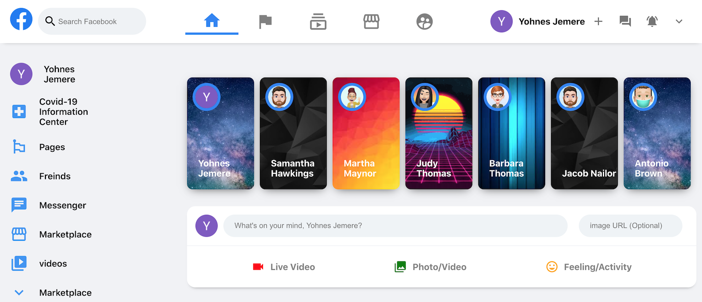

# Facebook Clone

Facebook clone using React(Context, Hooks), Material UI, Firebase(db, hosting, and authentication). Functionality includes google auth sign-in using firebase and ability to update the feed with text and image.

